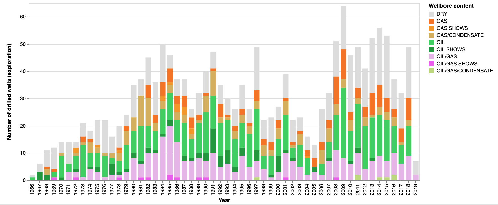

# EasyDataTools
Repository with friendly workflows in Jupyter Notebooks to work with mainly wellbore datasets from Norwegian Petroleum Directorate (NPD, public data, API). 
#
In the following notebook:
```
/notebook/well_data_norge_API_altair_graph.ipynb
```
we will work with the Exploration Wellbore Dataset from Norwegian Petroleum Directorate (NPD). The wellbore datasets are public domain. They are available [here](https://data.norge.no/data/oljedirektoratet/br%C3%B8nnbane-wellbore). <br> <br>
We will generate several stack bar graphs, using the ALTAIR library. The graphs will show us:
1. Status of all Exploration wells on the Norwegian Shelf since beginning of exploration, by year, number of wells and well content (oil/gas/condensate or any combination)
2. Status of Exploration wells between 1980 and 2019, by region: NORTH SEA, NORWEGIAN SEA and BARENTS SEA

We wished to make this notebook easy to follow so that anybody could understand the different steps of data wrangling to finally the stack bar graphs. We hope you enjoy its simplicity! <br><br>


