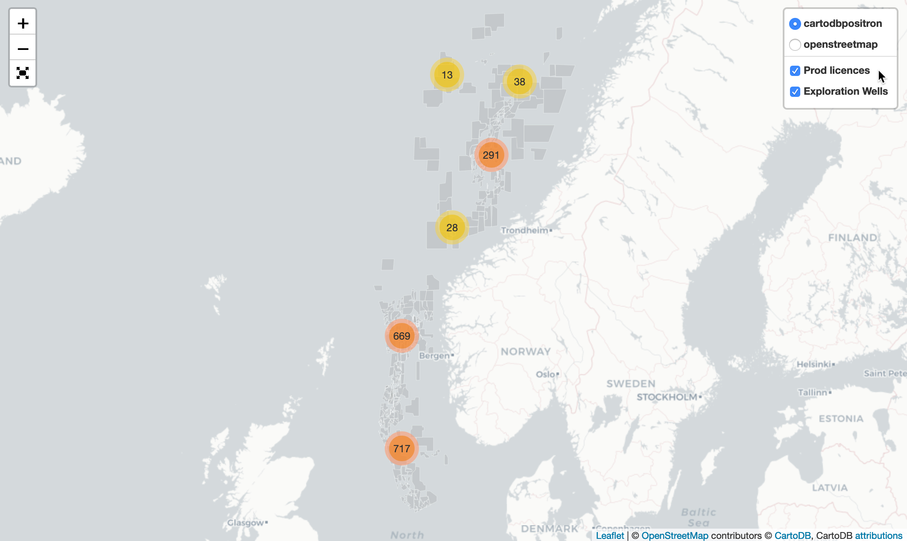
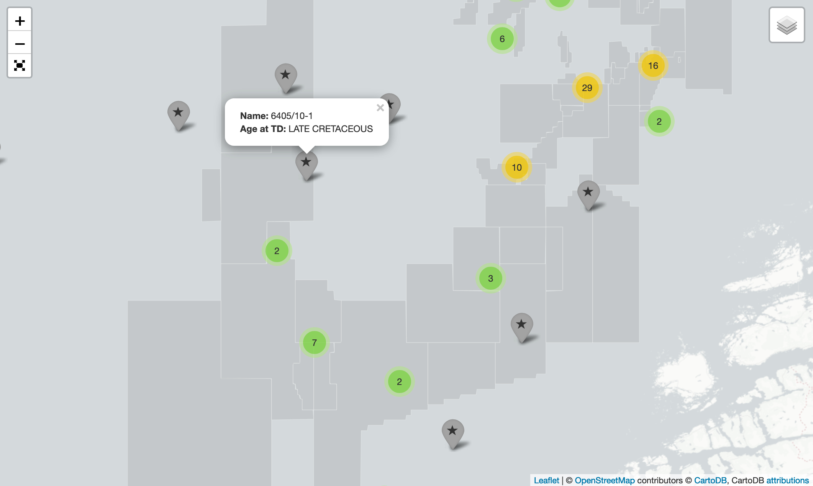
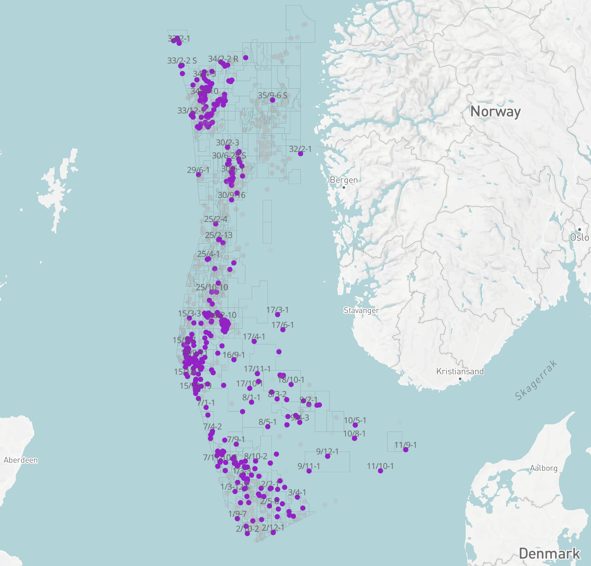
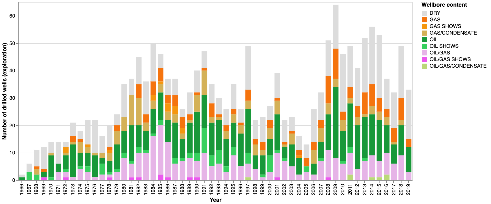

# EasyDataTools
Repository with friendly workflows in Jupyter Notebooks to work with mainly wellbore datasets from Norwegian Petroleum Directorate (NPD, public data, API). 
#
## Geospatialisation - Interactive map with Folium
In the following notebook:
```
/notebooks/interactive_map_Folium.ipynb
```
we will create an interactive map with Folium. We worked with clustered markers, layers which can be switched on/off, and added a fullscreen button.

The datasets are shapefiles coming from the Norwegian Petroleum Directorate, which is public data, and can be found [here](https://www.npd.no/en/about-us/information-services/available-data/map-services/). We used the wells and the production licences shapefiles.

This is a first version of this notebook, and we hope to add more functionalities in future. 

<br>

<br>
<br>

<br>

#
## Geospatialisation - Mapbox
In the following notebook:
```
/notebooks/geospatialisation_well_data_norge.ipynb
```
we will work with both the Exploration wellbore and the lithostratigraphy datasets from Norwegian Petroleum Directorate (NPD). The wellbore datasets are public domain. They are available [here](https://data.norge.no/data/oljedirektoratet/br%C3%B8nnbane-wellbore). We will use the API connection to get the datasets <br> <br>

### Description of the different data 'wrangling' steps:
1. Get the Exploration dataset, select columns and the wells for North Sea and Norwegian Sea only.

2. Get the lithostratigraphy dataset which has information about Formations and Groups for each well (including top and bottom depths). Select specific columns and only North Sea and Norwegian Sea areas. 

3. Merge a selection of columns from the Exploration dataframe together with the lithostratigraphy dataframe.

4. Add Geological age in the merged dataframe.

5. The resulting is a dataframe for all Explorations wells in North Sea and Norwegian Sea, with Formation, Group and Age for each row. Each row also has coordinates, which will allow us to export to a point SHAPEFILE and examine our dataset in a geospatial context, here we are using MAPBOX.

### Display in MapBox - wells with Triassic
Click [HERE](https://api.mapbox.com/styles/v1/annee/cjtxe6kxk2n9v1fpiqravigpi.html?fresh=true&title=true&access_token=pk.eyJ1IjoiYW5uZWUiLCJhIjoiY2puYng1ZjNlMDU3djN2c2YxdGxqeTk5biJ9.Iq8vP18GcAukiVpWNqJ5Pg#5.5/59.620860/7.760410/0) to open map in MapBox.
<br>

<br>
#
## Visualisation - wells stack bar graph
In the following notebook:
```
/notebooks/well_data_norge_API_altair_graph.ipynb
```
[](https://mybinder.org/v2/gh/AnneEstoppey/EasyDataTools/master?filepath=%2Fnotebooks%2Fwell_data_norge_API_altair_graph.ipynb)

we will work with the Exploration Wellbore Dataset from Norwegian Petroleum Directorate (NPD). The wellbore datasets are public domain. They are available [here](https://data.norge.no/data/oljedirektoratet/br%C3%B8nnbane-wellbore). <br> <br>
We will generate several stack bar graphs, using the ALTAIR library. The graphs will show us:
1. Status of all Exploration wells on the Norwegian Shelf since beginning of exploration, by year, number of wells and well content (oil/gas/condensate or any combination)
2. Status of Exploration wells between 1980 and 2019, by region: NORTH SEA, NORWEGIAN SEA and BARENTS SEA

We wished to make this notebook easy to follow so that anybody could understand the different steps of data wrangling to finally the stack bar graphs. We hope you enjoy its simplicity! <br><br>


